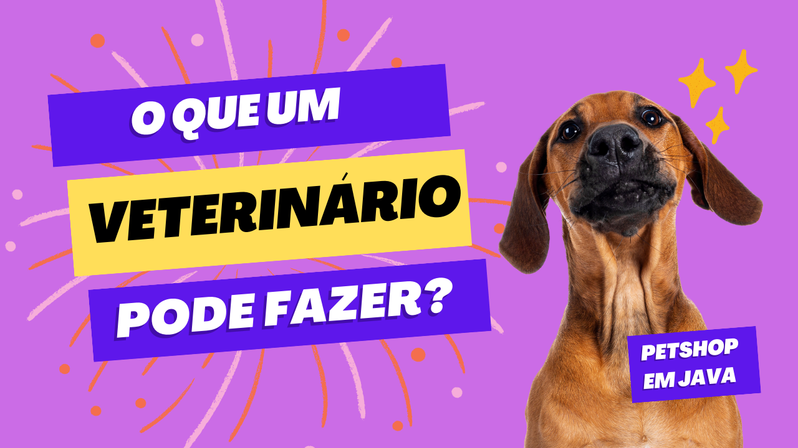
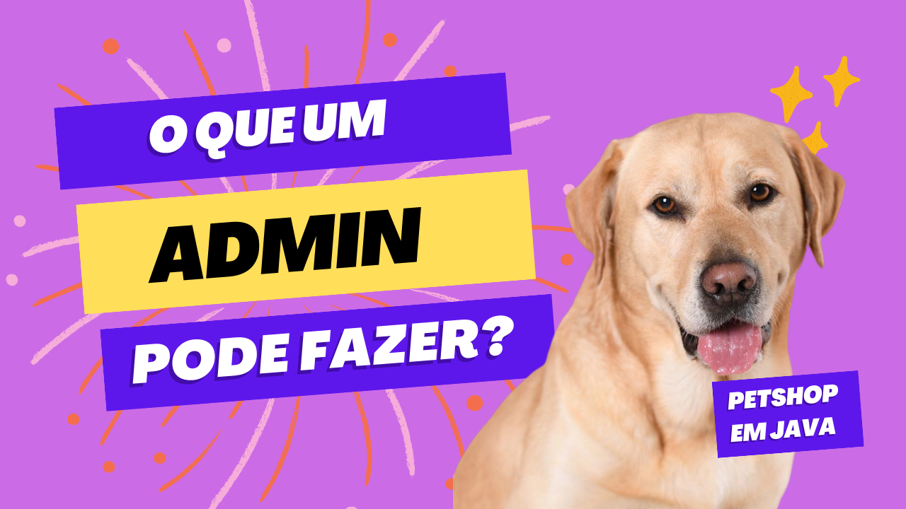
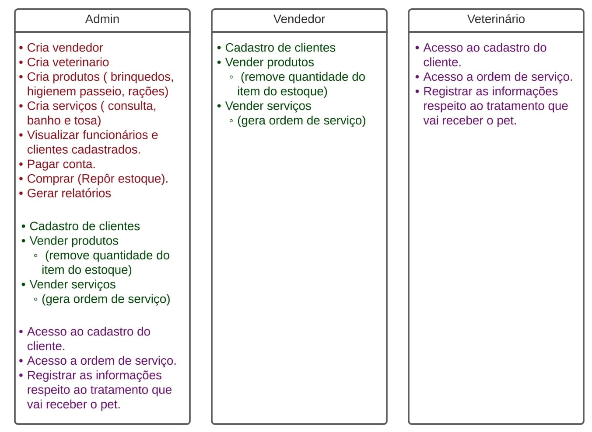
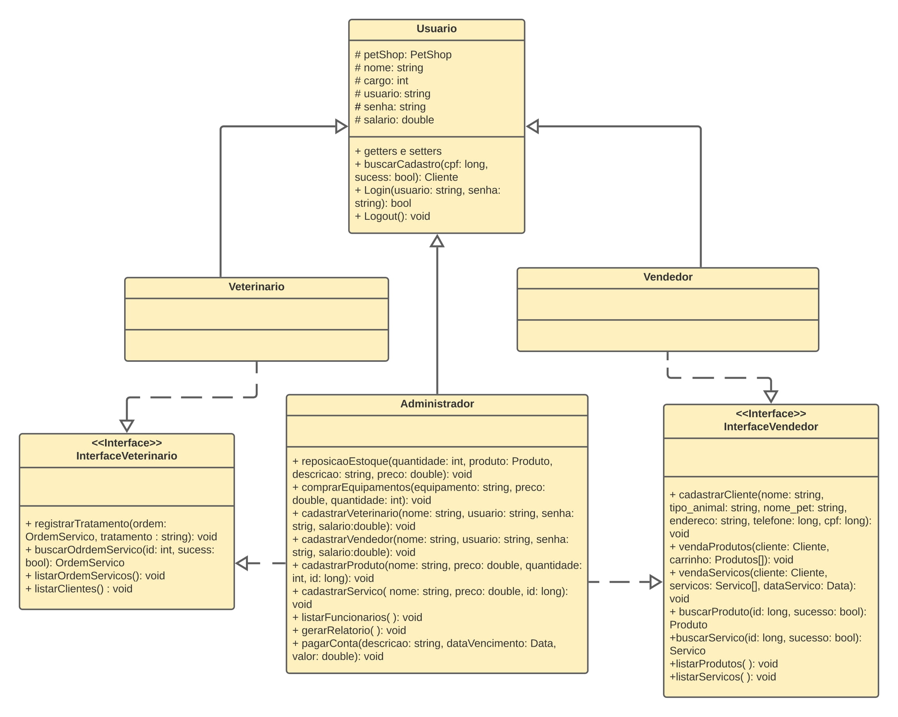
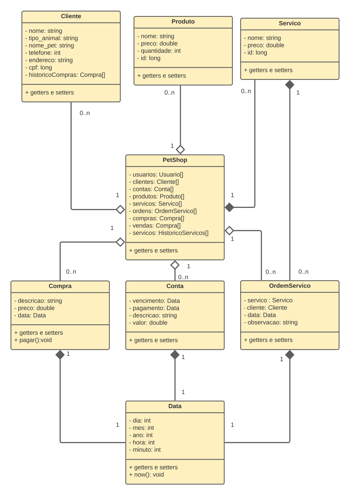
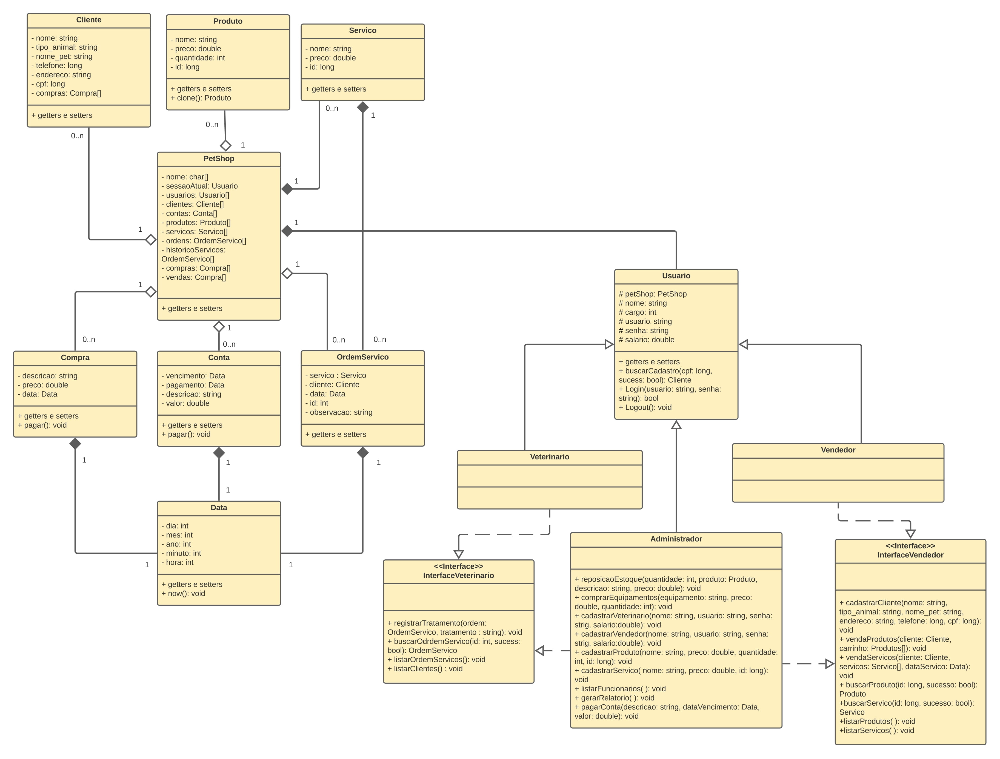
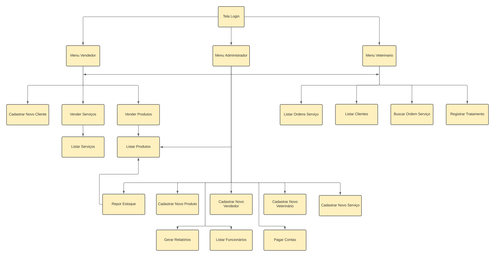

# Sistema de PetShop em java (swing)

## Descrição do projeto

    Projeto desenvolvido como atividade avaliativa da disciplina BCC221 UFOP.

O presente trabalho prático foi idealizado por meio da linguagem de programação JAVA, uma das principais linguagens na área de desenvolvimento de software. Além disso, é um projeto construído utilizando **os paradigmas de Programação Orientada a Objetos**, cujo principal objetivo é facilitar modelagens e o desenvolvimento de sistemas, já que possui uma maior aproximação com a vida real. Além disso, buscamos seguir os princípios [SOLID](https://link.medium.com/YyTdvfd3Mhb) com o objetivo de facilitar a manutenção e estensão do projeto.

O projeto consiste na implementação de um sistema de **controle e gerenciamento de uma loja Pet Shop**. Para isso, foi construído o diagrama UML, sendo este o principal responsável pelo norteamento da implementação das classes do sistema, assim como seus atributos e métodos. Além disso, por meio do UML, a visualização da comunicação entre cada classe tornou-se ainda mais clara.

## Ambiente de desenvolvimento e ferramentas

- javac: v11.0.11
- openjdk: v11.0.11
- make: v4.2.1

## Instruções de compilação e execução

Para compilar e executar o programa, basta clonar esse repositório e executar os seguintes comandos:

```
cd src
make
make run
```

### Acesso de um usuário vendedor (YouTube)

[](https://youtu.be/VVQ7Sh889Ug "Vídeo no YouTube: Funcionalidades de um vendedor (Clique para assistir)")

### Acesso de um usuário veterinário (YouTube)

[](https://youtu.be/osH_Bfsr9DM "Vídeo no YouTube: Funcionalidades de um veterinário (Clique para assistir)")

### Acesso de um usuário administrador (YouTube)

[](https://youtu.be/EY6K2Q2vHd8 "Vídeo no YouTube: Funcionalidades de um administrador (Clique para assistir)")

## Descrição da arquitetura

Cada tipo de usuário tem um certo conjunto de poderes, sendo o usuário administrador um "faz tudo". Na imagem abaixo, temos um diagrama de funcionalidades descrevendo o que cada um pode fazer.





**PetShop:** classe responsável pelo controle geral do estabelecimento, a qual possui acesso a todas as outras e contém todas as informações para o devido funcionamento da mesma.

**Usuário:** classe virtual, e também classe da qual todas as classes relacionadas aos indivíduos do estabelecimentos irão herdar atributos e métodos, sendo essas as informações que eram gerais para todos esses.

**Veterinário:** devido ao fato de os objetos em java terem permissão de herdar somente de uma classe, foi necessário criar uma classe interface para implementar as funções de veterinário para que a classe administrador possa usar as funcionalidades tanto de veterinário quanto de vendedor. Lembrando que essa classe também herda os atributos e métodos de usuário.

**Interface Veterinário:** é a classe que agrupa as funcionalidades de veterinário. Nela temos a implementação dos métodos de veterinário.

**Vendedor:** semelhante a classe veterinário, faz-se necessário também nessa classe, criar uma interface para implementar seus métodos, para que seja possível que a classe administrador possa usar as funcionalidades. Esta também herda atributos e métodos de usuário.

**Interface Vendedor:** como a classe interface veterinário, também agrupa as funcionalidades da classe vendedor. Nela temos a implementação dos métodos de vendedor.

**Administrador:** como essa classe, além de atributos e métodos especiais para ela, também possui os mesmos que qualquer outro funcionário do PetShop, foi implementada de forma que herdasse essas informações da classe usuário, veterinário e vendedor. Como citado, ela possui alguns métodos que são destinados a ter controle total sobre o estabelecimento.



**PetShop:** classe responsável pelo controle geral do estabelecimento, a qual possui acesso a todas as outras e contém todas as informações para o devido funcionamento da mesma.

**Cliente:** apesar de representar indivíduos que se relacionam com a clínica, ela independe da classe usuário, pois contém atributos e métodos próprios que representam somente os clientes.

**Produto:** classe que representa todos os produtos que serão comercializados na clínica.

**Serviço:** criada com o intuito de representar os serviços oferecidos, como por exemplo, banho, tosa e atendimento veterinário.

**OrdemServico:** classe que irá receber o serviço vendido para um cliente, sendo nessa classe a especificação de quando ele será realizado, sendo possível explicitar também se foi para algum cliente cadastrado ou não. Nessa classe, será permitido para atendimentos veterinários o preenchimento pelo veterinário as informações relacionadas ao tratamento realizado.

**Conta:** classe destinada para organizar os pagamentos internos do PetShop, como contas de luz, água, entre outros.

**Compra:** classe direcionada para a compra de produtos ou equipamentos para a clínica. Podendo envolver desde produtos para vendas, a produtos e equipamentos para seu funcionamento.

**Data:** classe utilizada para guardar qualquer informação relacionada às datas. Datas de serviços, de pagamentos ou vencimentos de contas.

Para facilitar a visualização da arquitetura implementada, abaixo, temos todo o diagrama UML referente à representação dos dados do sistema.



Com o intuito de auxiliar na visualização das telas e de seus caminhos, a seguir é apresentado o fluxo de telas para esclarecer o seu funcionamento e direcionamento.



## Decisões de projeto

- ### **Não persistência dos dados (dados voláteis)**

Em um cenário real, não faz sentido existir um sistema de gerenciamento de estoque, compras/vendas de serviços, funcionários e clientes se os dados desse sistema não persistirem. Porém, como o objetivo deste trabalho é treinar e praticar conceitos, paradigmas e implementação em POO, **a persistência dos dados não foi implementada** e, portanto, os dados do sistema são voláteis (os dados existem apenas durante a execução do programa).

Para facilitar testes, alguns produtos (osso, coleira, bolinha), serviços (tosa, banho) e funcionários já vem cadastrados.

- ### **Classes separadas das visualizações (telas)**

No lugar de colocar a visualização dos dados e menus de cada usuário dentro do próprio usuário, decidimos colocar isso em classes separadas buscando seguir os príncipios [SOLID](https://link.medium.com/YyTdvfd3Mhb). Dessa maneira, as classes Veterinario, Vendedor, Administrador e Usuario se tornam **mais reutilizáveis independentemente da camada de visualização dos dados** que coloquemos por cima delas.

- ### **Classe Petshop como um agregado de atributos**

Decidimos criar a classe PetShop de maneira que ela permitisse acessar todos os dados e informações do sistema, diminuindo assim a quantidade de parâmetros em funções que dependem de diversos dados do sistema. Sendo assim, a classe PetShop nada mais é que um apanhado de informações/atributos.

## Dificuldades encontradas

Uma das dificuldades encontradas foi na definição de qual seria o fluxo de telas e como os dados iriam transitar entre elas. Num primeiro momento, tivemos dificuldade em conseguir passar informação de uma tela pra outra. A solução foi passar o petshop para cada tela por meio de seu construtor.

Decidir quais telas eram realmente necessárias também foi uma questão. No início de nossas discussões, tínhamos pensado em fazer muito mais telas do que as que realmente chegaram a ser implementadas. A medida em que conversávamos, fomos percebendo que algumas telas eram simples de mais e que poderiam ser representadas por modais.

Uma outra dificuldade foi na hora de cadastrar um cliente _``on demand''_. Na tela de venda de produtos e serviços, nós deixamos a opção de cadastrar o cliente diretamente no momento da compra. Nesse sentido, tínhamos que ir para outra tela, realizar a operação de cadastro, voltar pra tela de venda e continuar de onde paramos para poder finalizar a compra. Essa transição pode parecer fácil, mas até chegar na solução utilizada, levantamos diversas possibilidades, dentre elas o uso de _threads_, _sleep_ e _wait_. Depois de passar um tempo tentando resolver o problema, conseguimos chegar numa solução mais limpa, clara e objetiva utilizando os próprios _event listeners_ do JFrame.

## Recursos de linguagem

No trabalho prático, temos que, um usuário é um administrador, veterinário ou vendedor. Algumas das funcionalidades que um usuário pode fazer, outros também podem. Essa situação dentro da programação orientada a objetos, pode gerar uma herança múltipla entre mais de duas classes. Java não suporta herança múltipla, e por isso, foi utilizado o recurso de interface oferecido pela linguagem como alternativa, de modo que determinadas classes implementam os métodos descritos nas interfaces criadas. Sendo assim, mais de uma classe pode implementar métodos ou funcionalidades de uma mesma interface.

Na linguagem, é possível a importação de vários pacotes, que possuem classes relacionadas, que possibilitam a reutilização de códigos. É possível utilizar várias classes de um pacote em java, fazendo sua importação, sendo um recurso muito importante. Neste trabalho, para a implementação de interface gráfica, foram utilizadas as classes do pacote javax.swing. Com esse pacote, com suas classes e seus métodos associados, construímos componentes gráficos como frames, painéis, botões, tabelas, labels e entre outros, com possibilidade de ações em cima desses componentes, implementadas por meio de métodos das classes dos componentes e de outras.

Outro recurso de java muito útil foi o uso de método listener de componentes da interface gráfica. Com esse recurso, foi possível definir o que fazer caso o usuário faça uma determinada ação, como o que deve ser feito se o usuário clicar sob um botão da interface gráfica, por exemplo.

A classe String do pacote java.lang oferece vários métodos muito úteis para a manipulação de strings em java. Utilizando um objeto dessa classe, que no caso, é um objeto string, podemos chamar vários métodos e tipos de construtores diferentes. Um dos métodos que foi utilizado no trabalho, foi o método startsWith, que recebe como parâmetro uma string e faz o casamento de cadeia com a string que o chamou, se as cadeias se casarem, o método retorna true e caso contrário, retorna false. A utilização desse método trouxe como recurso uma busca mais aprimorada, onde o usuário digita um texto (string) e tem-se o retorno com base em um casamento exato do texto que ele digitou.

## Referências

- [O que é SOLID: O guia completo para você entender os 5 princípios da POO](https://link.medium.com/YyTdvfd3Mhb).
- [Hélio (2016). Introdução aos Default Methods do Java 8](https://www.devmedia.com.br/introducao-aos-default-methods-do-java-8/36876).
- [Bergin, Joseph (2012). Herança múltipla em Java](https://imasters.com.br/back-end/heranca-multipla-em-java).
- [Franzini, Fernando (2017). Herança múltipla no Java?](https://imasters.com.br/back-end/heranca-multipla-no-java-no-java8-pode-sim).
- [GUJ. Herança Multipla no Java](https://www.guj.com.br/t/heranca-multipla-no-java/72545).
- [Oracle. Class String](https://docs.oracle.com/javase/7/docs/api/java/lang/String.html).

# Made with :heart: by

- [Danielle Emely de Souza Almeida](https://github.com/DanielleEmely)
- [Danilo César Silva Soares](https://github.com/Cesar-Danilo)
- [Iago Izidório Lacerda](https://github.com/iagoizi)
- [João Vítor dos Santos Vaz](https://github.com/joaovitorvaz)
